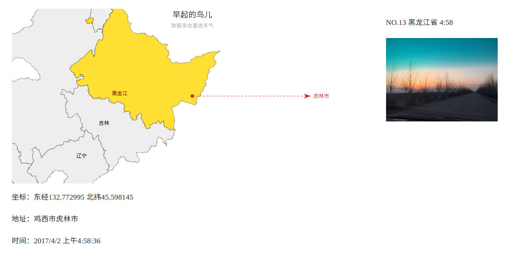

### 关于

通过对墨迹天气APP的抓包，找出了API。然后通过爬虫获取实时数据并保存，前端调用数据并用地图可以视化处理。

#### 用到以下技术或资源

- [Scrapy](//scrapy.org/): 爬虫框架
- [Mongodb](//www.mongodb.com/): 存储数据
- [Bootstrap](//getbootstrap.com/): CSS
- [Echarts](//echarts.baidu.com/): 前端图表插件

### 使用

- 安装Scrapy和Mongodb  
- 在根目录 make start  

前后端处理得都比较粗糙，需自行完善。
